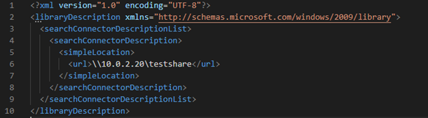
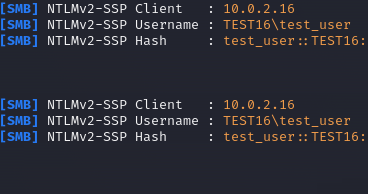
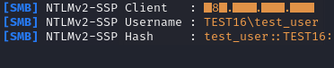
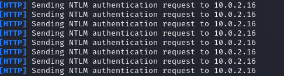

# Утечка учётных данных через CVE-2025-24071 
*Дмитрий Лифанов*

В мартовском обновлении безопасности Microsoft Windows была устранена уязвимость CVE-2025-24071, которая может привести к утечке учётных данных через механизм обработки файлов при индексации. После исправления этой уязвимости в открытых источниках была описана соответствующая [техника атаки](https://cti.monster/blog/2025/03/18/CVE-2025-24071.html). Рассказываем, в чём заключается атака и как её детектировать.

Формат .library-ms является доверенным для Windows Explorer, так как используется для определения расположения библиотек. После распаковки такого файла из RAR/ZIP-архива система автоматически парсит и индексирует содержимое файла для того, чтобы правильно отображать иконки, превью и метаданные.   

Атакующий может создать вредоносный файл .library-ms, содержащий в себе секцию <simpleLocation> со ссылкой на контролируемый SMB-сервер, поместить его в архив и направить жертве:

В момент распаковки архива произойдет автоматическая обработка файла .library-ms с целью сбора метаданных для индексации, что приведет к попытке разрешить удаленный узел и обратиться на указанный в секции <simpleLocation> путь.

Такое действие приводит к неявной для пользователя попытке NTLM-авторизации на целевом узле, вследствие чего атакующий может получить NTLM-хэш жертвы и далее использовать для своих целей. Пример для атаки с обращением на локальный узел:

Данный сценарий работает как для локальной инфраструктуры, так и для внешних адресов, при условии наличия сетевой связанности между узлами. Вот пример для атаки с обращением на внешний узел:

Дополнительно к этому будут произведены попытки обращения с использованием WebDAV, но в данном случае учетные данные пользователя не будут переданы на целевой сервер. В случае с использованием responder на стороне атакующего это приведет к попытке отправить запрос на NTLM-аутентификацию, но с пользовательской стороны не вызовет никаких диалоговых окон, запрашивающих учетные данные пользователя:

Также стоит отметить, что данный сценарий может воспроизводиться и в случае размещения .library-ms файла в различных каталогах – например, при размещении файла на рабочем столе пользователя. В момент входа и загрузки рабочего стола произойдет аналогичный запрос, где источником будет процесс COM-сервера, отвечающего за генерацию кэша эскизов.

## Как предотвратить попытки эксплуатации данной уязвимости:

- Запретить на почтовом сервере и почтовых клиентах возможность получения и обработку файлов .library-ms;
- Отслеживать сетевые обращения по SMB на внешние IP-адреса и узлы;
- В сценарии с размещением файла на рабочем столе или в корзине сетевое взаимодействие будет инициировано от COM-сервера Thumbnail Cache Class Factory for Out of Proc Server, отвечающего за генерацию экзизов. Инициатором обращения в таком случае будет  Dllhost.exe, cодержащий в командной строке CLSID данного COM-сервера:  
C:\Windows\system32\DllHost.exe /Processid:{AB8902B4-09CA-4BB6-B78D-A8F59079A8D5};
- Большинство приложений для взаимодействия с WebDAV-серверами используют системный сервис WebClient. Поэтому стоит обращать внимание на внешние соединения инициированные через C:\WINDOWS\system32\svchost.exe -k LocalService -p -s WebClient, содержащий в user-agent параметр Microsoft-WebDAV-MiniRedir/*. 
- В некоторых сценариях может происходить обращение напрямую без использования сервиса WebClient; например, исполняемый процесс WinRAR может произвести обращение к целевому узлу, в user-agent такого обращения будет значится DavClnt;
- Отслеживать появление в системе файлов  .library-ms, созданных процессами архиваторов, почтовых клиентов, браузеров и процессами из [LOLBin](https://lolbas-project.github.io/).
