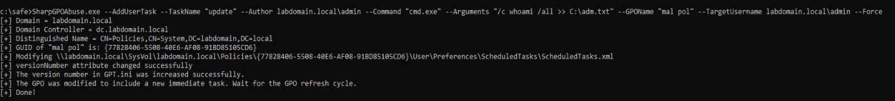
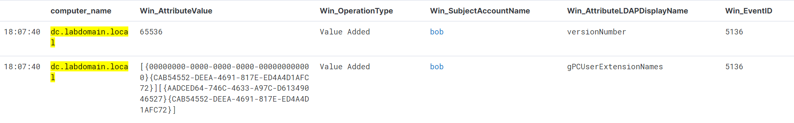
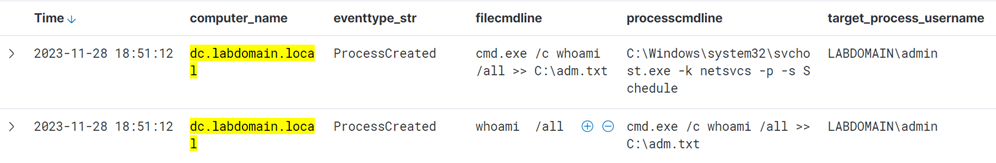
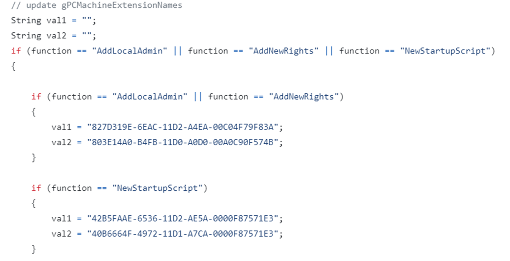
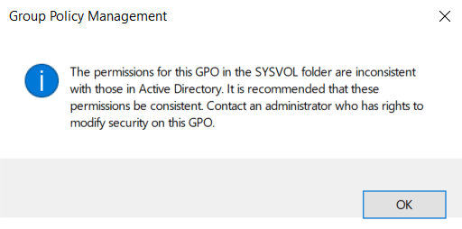
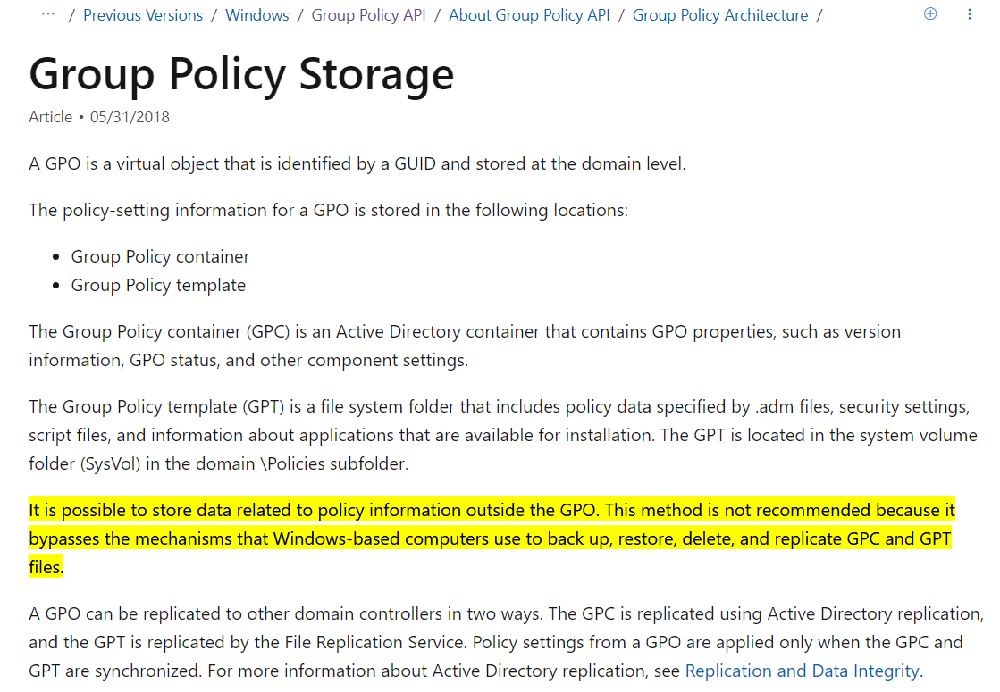
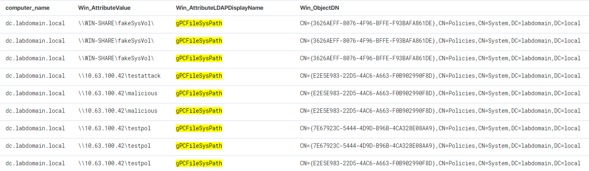
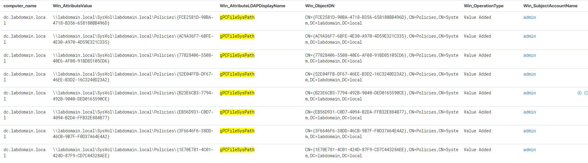

# Атаки через групповые политики
*Глеб Иванов*

Групповые политики в Windows (**Group Policy Objects, GPO**) дают админам возможность контролировать настройки пользователей и компьютеров в доменной среде. Но эта же фича в руках злоумышленников позволяет проводить различные атаки. Наиболее распространённый сценарий – массовый деплой шифровальщика на множество хостов, что мы не раз наблюдали в отчетах нашей команды GERT. Также групповые политики могут использоваться для скрытого закрепления в домене, где атакующие могут делать практически всё, что пожелают:
- Создавать новых локальных пользователей/админов
- Создавать вредоносные задачи в планировщике
- Создавать различные сервисы
- Запускать задачи из-под системы и/или пользователя
- Менять конфигурацию реестра
- И т.д.

## Изменение атрибутов gPCMachineExtensionNames и gPCUserExtensionNames

Существует несколько инструментов, которые специально нацелены на компрометацию GPO. По функционалу все они похожи, поэтому остановимся на наиболее популярном (после MMC) из них [SharpGPOAbuse](https://github.com/FSecureLABS/SharpGPOAbuse). Данный инструмент отлично показывает, какие изменения происходят при модификации GPO. В качестве примера создадим пользовательскую задачу в планировщике, которая будет запускаться из-под пользователя “labdomain.local\admin”: 



В ходе выполнения модификации GPO, сначала происходит добавление новой задачи в виде xml в GPT, что расположен на SysVol. После этого меняется атрибут versionNumber и номер версии в файле GPT.ini на более высокий, чем есть сейчас, чтобы клиент при сравнении версии GPO с своей закэшированной версией скачал более свежую. 

Отследить подобные модификации нам поможет событие [5136](https://learn.microsoft.com/en-us/previous-versions/windows/it-pro/windows-10/security/threat-protection/auditing/event-5136) на изменение объектов AD:



Так как мы создавали пользовательскую политику, то изменялось и значение атрибута **gPCUserExtensionNames**, в которой мы видим [GUIDs](https://learn.microsoft.com/en-us/openspecs/windows_protocols/ms-gppref/a00e597a-cd21-4a97-9277-f53fae251acf) от CSE:
- {00000000-0000-0000-0000-000000000000} - Core GPO Engine
- {CAB54552-DEEA-4691-817E-ED4A4D1AFC72} - Preference Tool CSE GUID Scheduled Tasks
- {AADCED64-746C-4633-A97C-D61349046527} - Preference CSE GUID Scheduled Tasks 

После того, как политика применилась, запустится пользовательская задача:



Для каждой из функций инструмента SharpGPOAbuse существует свой набор CSE, которые будут записываться в атрибуты пользователя или компьютера:



На основе данных CSE можно разработать SIGMA-правила обнаружения подобных политик. Вот правило для детектирования добавления новых привилегий через GPO:
```
title: Adding new privilege via GPO
description: Detects events of adding specific attributes for gPCMachineExtensionNames
tags:
    - attack.privilege_escalation
    - attack.defense_evasion
    - attack.t1484
    - attack.t1484.001
logsource:
    product: windows
    service: security
detection:
    selectionEvent:
        EventID: 5136
        OperationType: 'Value Added'
        AttributeLDAPDisplayName: 'gPCMachineExtensionNames'
    selectionAttribute:
        AttributeValue|all:
            - '{827D319E-6EAC-11D2-A4EA-00C04F79F83A}'
            - '{803E14A0-B4FB-11D0-A0D0-00A0C90F574B}'
    condition: selectionEvent and selectionAttribute
falsepositives: 
    - Legitimate execution by system administrators.
level: medium

```

Детектирование добавления скриптов автозапуска через GPO:
```
title: Adding startup/logon script via GPO
description: Detects events of adding specific attributes for gPCMachineExtensionNames or gPCUserExtensionNames
tags:
    - attack.privilege_escalation
    - attack.defense_evasion
    - attack.persistence
    - attack.t1484
    - attack.t1484.001
    - attack.t1547
logsource:
    product: windows
    service: security
detection:
    selectionEvent:
        EventID: 5136
        OperationType: 'Value Added'
        AttributeLDAPDisplayName: 
        - 'gPCMachineExtensionNames'
        - 'gPCUserExtensionNames'
    selectionAttribute:
        AttributeValue|all:
            - '{42B5FAAE-6536-11D2-AE5A-0000F87571E3}'
            - '{40B6664F-4972-11D1-A7CA-0000F87571E3}'
    condition: selectionEvent and selectionAttribute
falsepositives: 
    - Legitimate activity by system administrators.
level: medium

```

Детектирование добавления новой задачи планировщика через GPO:
```
title: Adding sheduled task via gpo
description: Detects events of adding specific attributes for gPCMachineExtensionNames or gPCUserExtensionNames
tags:
    - attack.privilege_escalation
    - attack.defense_evasion
    - attack.persistence
    - attack.t1484
    - attack.t1484.001
    - attack.t1053
    - attack.t1053.005
logsource:
    product: windows
    service: security
detection:
    selectionEvent:
        EventID: 5136
        OperationType: 'Value Added'
        AttributeLDAPDisplayName: 
        - 'gPCMachineExtensionNames'
        - 'gPCUserExtensionNames'
    selectionAttribute:
        AttributeValue|all:
            - '{AADCED64-746C-4633-A97C-D61349046527}'
            - '{CAB54552-DEEA-4691-817E-ED4A4D1AFC72}'
    condition: selectionEvent and selectionAttribute
falsepositives: 
    - Legitimate activity by system administrators.
level: medium

```

## Изменение атрибута gPCFileSysPath

В некоторых [сценариях](https://www.synacktiv.com/en/publications/gpoddity-exploiting-active-directory-gpos-through-ntlm-relaying-and-more#part_3_b) атакующий не может получить доступ к SysVol, из-за отсутствия прав на изменение GPT. Он получит следующую ошибку - несоответствие прав между разрешениями LDAP и SMB:



В таких случаях можно изменить атрибут GPC – **gPCFileSysPath**, где можно указать путь до подконтрольного атакующим сетевого ресурса, тем самым все клиенты, на кого распространяется политика, будут идти на данный ресурс. Подобным функционалом обладает инструмент [GPOddity](https://github.com/synacktiv/GPOddity). Он поднимает собственный SMB-сервер, где создает вредоносные политики, после чего изменяет путь до GPT, а после применения политик, восстанавливает старые из своего бэкапа:


Данную технику изменения атрибута gPCFileSysPath подсвечивал в своем блоге исследователь [Mark Gamache](https://markgamache.blogspot.com/2020/07/exploiting-ad-gplink-for-good-or-evil.html), когда работал в Microsoft. Однако ему ответили, что это не является багом – данные о групповых политиках могут храниться не только в системной папке SysVol, хотя [делать это не рекомендуется](https://learn.microsoft.com/en-us/previous-versions/windows/desktop/policy/group-policy-storage), потому что это может поломать некоторые механизмы Windows:



Чтобы детектировать подобную технику, мы снова можем воспользоваться событием [5136](https://learn.microsoft.com/en-us/previous-versions/windows/it-pro/windows-10/security/threat-protection/auditing/event-5136), где будем отслеживать модификацию нужного нам атрибута **gPCFileSysPath**:



В исключения нужно добавить события, которые генерируются при создании нового GPO, где в атрибуте указан нормальный путь до GPT:

```
\\<domain>\SysVol\<domain>\Policies\<GPO GUID>
```



В итоге правило для детектирования изменения атрибута gPCFileSysPath выглядит так:

```
title: Setting the gPCFileSysPath attribute
description: Detects changing the gPCFileSysPath attribute.
tags:
    - attack.privilege_escalation
    - attack.defence_evasion
    - attack.t1484
    - attack.t1484.001
logsource:
    product: windows
    service: security
detection:
    selection:
        EventID: 5136
        AttributeLDAPDisplayName: 'gPCFileSysPath'
        OperationType: 'Value Added'
    filter:
        AttributeValue|re: '(?i)\\\\(?<domain>[\w.-]+)\\sysvol\\\k<domain>\\'
    condition: selection and not filter
falsepositives:
    - Unlikely
level: high

```

