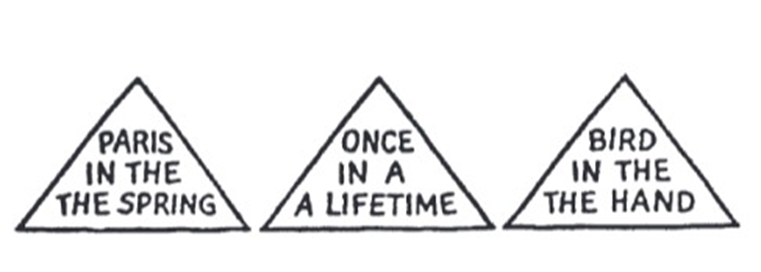
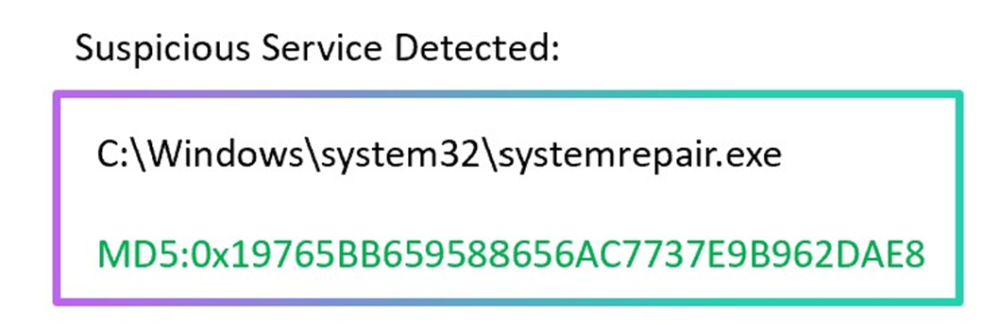
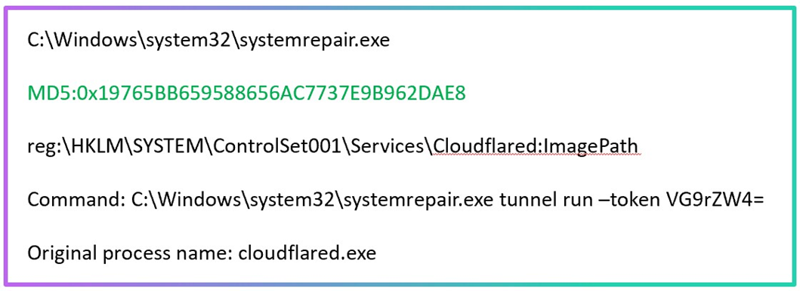
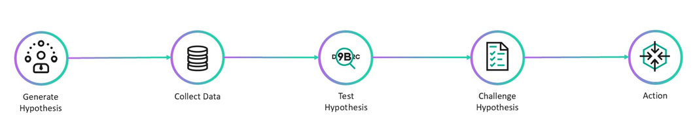
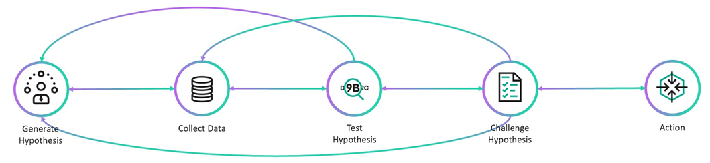
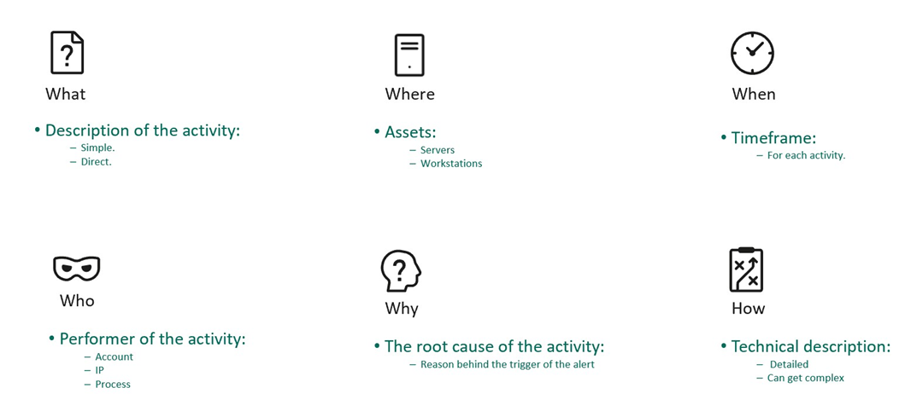
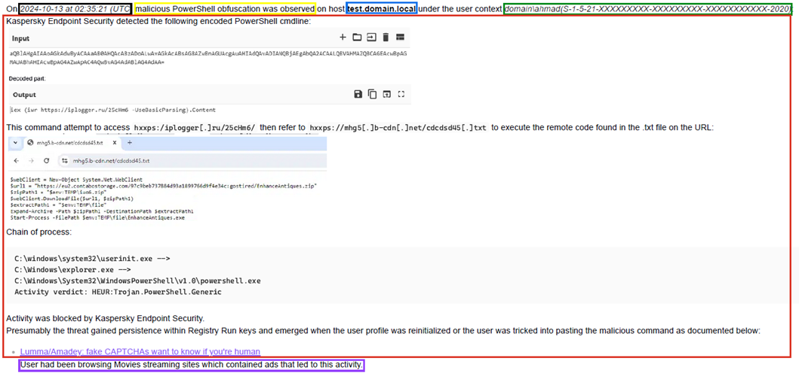

# Human factor in cyber defense: when the enemy is our own mindset
*By [Taha Hakeem](https://sa.linkedin.com/in/taha-hakeem)*

## Introduction

Working in a Security Operation Center can be stressful due to the nature of the job: the analyst has to deal with ever-changing advanced threats and to make rapid decisions with ambiguous information. This makes our job depending not only on formal technical knowledge but also on some kind of analytical intuition & mindset. So when a newbie comes to SOC the most common training advice would be "Look at our top analyst, watch and learn how he does his work".

Meanwhile, this top analyst cannot really explain how he does it but he knows how to gets it done. This is normal and this is where the experience and mindset come along.

The explanation of the above example: **thinking analytically is a skill that learned by practicing**. An experienced analyst can determine what is suspicious and what is not, when to stop gathering data, what to make out of those data and, most importantly, how to make the right decision - while for a newbie all of this is not clear. Only as time passes, the analyst becomes self-conscious about his analysis and sharpens his thinking process. 

This issue can be tackled by understating how conclusions are made, and what makes them right without getting biased and fallen into analytic traps. When an analyst makes a mistake and it is not a case of technical knowledge, then the issue most likely relays on the mindset of the analyst.

This article explores how adopting a long-term, purpose-driven mindset can empower SOC teams to continuously improve, adapt, and thrive in an ever-changing threat landscape.

## The Infinite game: a long-term perspective

First, let's define the difference between Finite and Infinite games:

Finite game: the players & the objectives are known and the game has an ending. Like football, chess and most of all the games we know. You can win such a game by achieving the known objective by the end of the game.

Infinite game: both players & objectives are changeable at any point, and the game never ends. This is business or (in our case) how SOC works. On a wider range, it's... life. You cannot ultimately win in such a game but you should try to _keep winning_ since the game never ends.

Traditional approaches in many fields emphasize short-term victories. In contrast, an infinite mindset focuses on long-term resilience and continuous improvement. In the context of SOC operations, this means:

- Long-Term Vision (a just cause): Focus on protecting the organization instead of chasing quick wins on individual alerts.
- Trusting Teams: Risk-free culture built on trust where the analyst is not afraid to talk or even make a mistake in the process of doing the right thing.
- Worthy Rivalry: Instead of viewing threat actors or red-teamers just as enemies to defeat, see them as a force that pushes your team to enhance your methods continuously.
- Existential Flexibility: Openness to change. The threat landscape is always evolving, so should the team mentality and strategies be doing.
- Courage to Lead: Effective leadership in the SOC requires making bold decisions under uncertainty.

Having a finite mindset while you operate on infinite field such as SOC leads to burning out. An analyst with infinite mindset can discover the most complex case and fully handle it only to continue to the next one, while those with finite mindset would see this as a victory to celebrate and lay their guards down.

## Understanding limitations

It's no surprise analysts can make incorrect judgments considering the high level of uncertainty in their job:
- lack of log collection,  
- new tactics and techniques introduced regularly,    
- attackers/ red-teamers constantly trying to deceive analysts,    
- lack of proper communication (client-related teams).

Our minds don’t like uncertainty and tend to fill the gaps. With the above factors of uncertainty, SOC analysts unconsciously become biased as they make conclusions driven by their beliefs and assumptions – their mindsets. Knowing the limitations and biases is not enough to solve this issue but it is a start. 

## Perception: why can’t we see what is there to be seen?

One of the most fundamental principles of perception: **We tend to perceive what we expect to perceive**. Here is a example:

If you missed the repetition of the words in the picture above at first, that's because you did not expect to find an error. People are more likely to notice what they _expect_ to see. There are a lot of "Awareness test" & "Selective attention" videos on Youtube showing the same concept:
    
[https://www.youtube.com/watch?v=1nL5ulsWMYc](https://www.youtube.com/watch?v=1nL5ulsWMYc)  

[https://www.youtube.com/watch?v=xNSgmm9FX2s](https://www.youtube.com/watch?v=xNSgmm9FX2s)

Same way, there are patterns of expectations that tell SOC analysts what to look for, what is important, and how to interpret what is seen.

One of the most important characteristics of mindsets is: mindsets tend to be quick to form but resistant to change. The more ambiguous the information, the more confident is the actor of the validity of his image, and the greater is his commitment to the established view. 

The above picture can be seen as a back shot of a young woman or front shot of an old woman. Whatever you see first you'll find hard time switching back and forth between two ways of viewing. 

This tells us how difficult it could be to look at the same information with a different perspective. And what is more important, the initial exposure to blurred or ambiguous stimuli interferes with accurate perception even after more and better information becomes available. If the analyst gets used to see the same alerts over and over this is likely going to occur.

That's why fresh perspective is sometimes useful; past experience can handicap as well as aid analysis. Asking for a second opinion could be helpful. You should make your basic hypothesis and reasoning as clear as possible so they can be challenged by others (and yourself) to examine their validity.

## Types of biases in SOC

Seeing that our minds can trick us brings up the question: how can we be biased on our daily work? Here are the most common biases that occur in SOC.

**Confirmation Bias**: trying to focus on information that confirms pre-existing beliefs. For example, an analyst assumes an alert is caused by a scanner, so he starts looking for Nessus, Rapid7 or some other scanner processes in the host.

To avoid this bias the analyst should try to disconfirm what was first assumed while approaching the alert.

**Anchoring Bias**: being affected by the first piece of information observed. For example, an analyst can dismiss an alert because the process name is a signed system process. Look at the example below:

The mistake some analysts would fall into is dropping this alert as the process is clean and signed. However, if you look for the full context, you'll see this is a tunneling tool masquerading to be a system process:

The process itself is not malicious so there is no reason to be tagged by AV products. However, having the process renamed and located within the system32 folder is highly suspicious.

The analyst should make the judgment based on the full picture. It does not matter what information was discovered first: the actual timeline of the activity matters.

There are also other conditions that lead to bad judgment:

- Satisficing: selecting the first "good enough" solution rather than examining all possibilities to get "the best." This often occur when the SOC is high-loaded.
- Consensus: selecting the easy way which makes an analyst feel good in an ideal fantasy world with minimal effort. For example, assuming that suspicious behavior is an internal admin activity.
- Reasoning by analogy: relying too much on past info. For example, ignoring the IP/user account that had been used for red-teaming a long time ago – and suddenly became active. Or another situation: there is a rule that always generates FP so the analyst decides to close the alert without investigating it properly.

## Solution: challenging the hypothesis

Analysts should be self-conscious about their reasoning process. They should think about how they make judgments and reach conclusions, not about the results of those judgments and conclusions only.

When approaching alerts, don't make quick assumptions. Instead of this, generate hypothesis and try to prove them wrong in order to get the best results. Here's how the analyst starts their work:

- Generate hypothesis: use alert description and logic.
- Collect related data: keep in mind that "more data" isn't always equal to "better analysis".
- Test hypothesis: investigate and analyze.
- Challenge hypothesis: review & try to avoid biases and mind traps; a second opinion is useful at this stage.
- Action: make the judgment.

This is not a linear process and it's possible to go back on stages, so in real life it looks like this:

## Tackling the alerts: 5W1H

A well-organized system to tackle the alerts can help an analyst to make all the needed steps without rushing into conclusion. The _5W1H_ is a method to solve problems by answering 6 basic questions of what, who, when, where, why, and how:

- What
	- What happen and what are you investigating (Describing the activity with one or 2 sentences).
- Where
	- Where did the activity took place (Endpoint, Server).
- When
	- When did the activity take place (Time).
- Who
	- Who made the activity in question (User, IP, Process).
- Why
	- Why is this activity occurring. The root cause that triggered this alert.
- How
	- How the activity is done (Technically, TTP).

The example below shows how the 5W1H is implemented:

- What (Yellow)
- Where (Blue)
- When (Black)
- Who (Green)
- Why / Root Cause (Purple)
- How (Red)

Answering these simple questions in the right way will get the analysts good understating of what they are dealing with. It also becomes handy when you are preparing the report.

Another reliable system: Analysis of Competing Hypotheses (ACH). See for example [“Analysis of Competing Hypotheses, WCry and Lazarus”](https://isc.sans.edu/diary/22470).

The above methods are not used on every single case. The direct/repetitive cases should be handled once, then tuned or automated. As time passes, the analysts understand how they reach conclusions, and the process becomes smoother & easier.

## General tips for SOC analyst

- Treat every alert as a potential compromise. (You hear this all the time and this should always be followed)
- FP means you know exactly what happened and there is ZERO security risks. (Remember, the adversaries are trying to trick you)
- Challenge your beliefs & conclusions. (Recognize your biases)
- Ask for a second opinion. (Different minds see different things)
- Learn from the past. (Reviewing the mistakes and blind spots of yours or others and learn from them).
- Think like an attacker.
- Keep learning.

## References 

This article is influenced by:    
- Psychology of Intelligence Analysis by Richards J. Heuer, Jr     
- Chris Sanders talk (A Cognitive Psychology Approach of Security Investigations, Ops Track).
- The Infinite Game by Simon Sinek.

