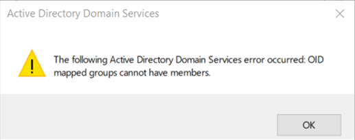
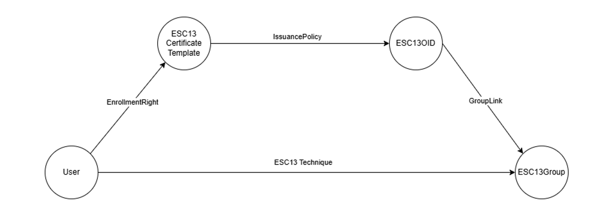
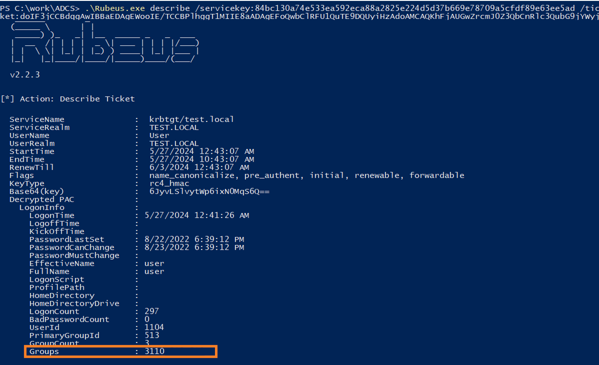
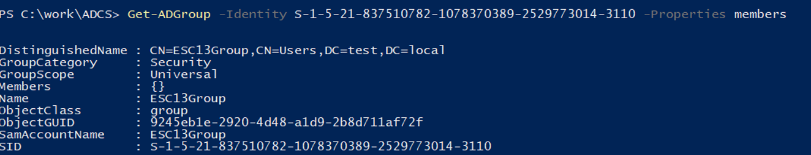
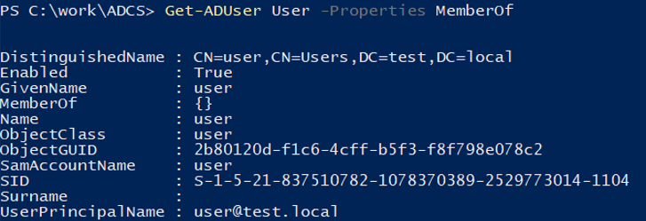
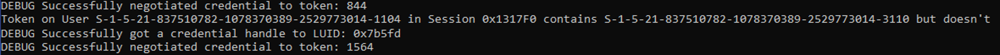
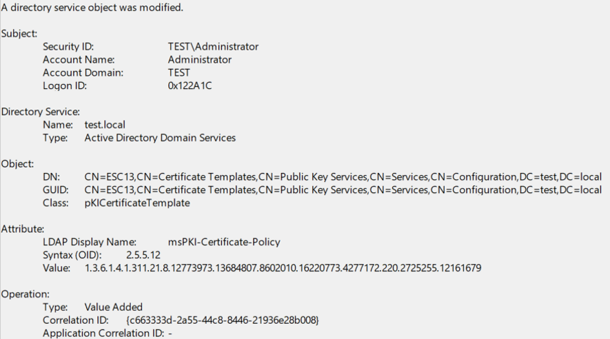
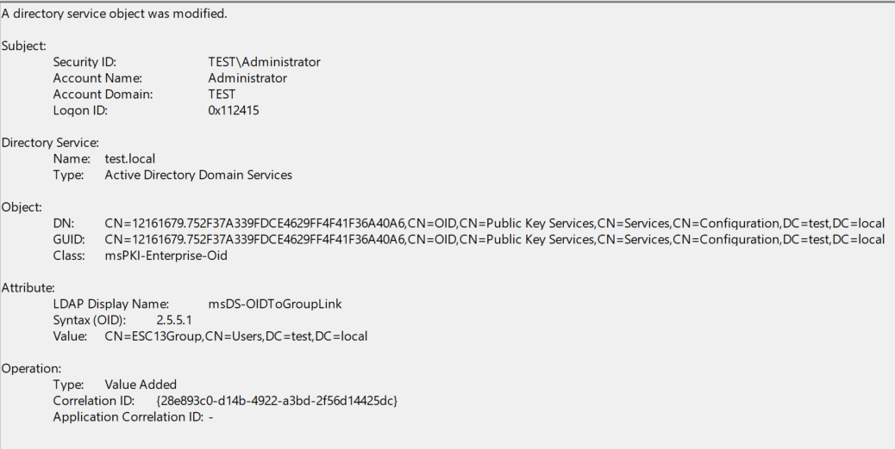
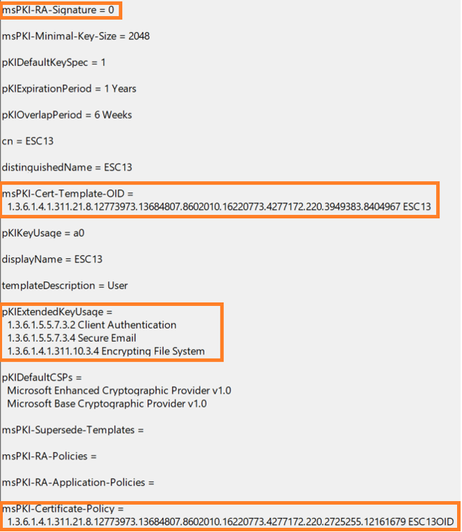
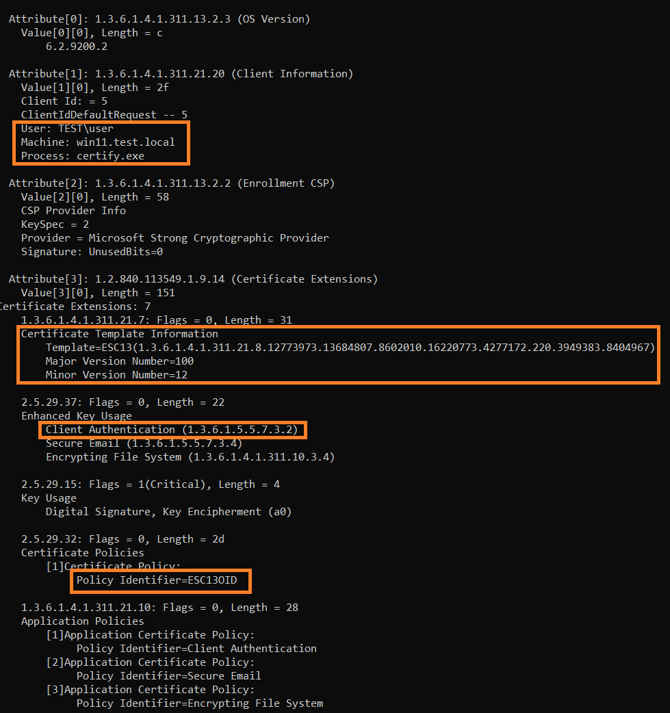

# Ловим повышение привилегий: детектирование техники ADCS ESC13
*Дмитрий Щетинин*

В феврале этого года исследователи из Specter Ops подсветили очередную технику абьюза ADCS и дали ей название [ESC13](https://medium.com/specter-ops-posts/adcs-esc13-abuse-technique-fda4272fbd53). Для понимания того, как работает эта техника, нужно разобраться в двух понятиях.

Первое - это объект **Issuance Policy**, который используется для управления доступом. Система может потребовать от пользователя предоставить сертификат с определенной **Issuance Policy**, чтобы гарантировать, что доступ предоставлен только правильным, авторизированным пользователям.

Второе понятие - это атрибут [msDS-OIDToGroupLink](https://learn.microsoft.com/en-us/windows/win32/adschema/a-msds-oidtogrouplink).

Класс **Issuance Policy** в Active Directory содержит атрибут **msDS-OIDToGroupLink**, и его можно использовать для линковки **Issuance Policy** с группой AD. Таким образом, системы будут авторизовать пользователей, как будто они включены в группу. Работать это будет в случае, если пользователь предоставит сертификат с необходимой **Issuance Policy**.

Данный механизм используется в [Microsoft Authentication Mechanism Assurance (AMA)](https://learn.microsoft.com/en-us/previous-versions/windows/it-pro/windows-server-2008-R2-and-2008/dd378897(v=ws.10)?redirectedfrom=MSDN#technology-review). Создан он был для защиты ресурсов, предоставляя права только пустым группам AD и заставляя администраторов ресурсов использовать аутентификацию с помощью сертификатов. Поэтому в группы AD, слинкованные с **Issuance Policy**, невозможно добавить пользователей - при попытке добавления появится сообщение об ошибке:

Таким образом, если у нас есть пользователь, который может запросить сертификат, используя **Certificate Template** (ESC13) с возможностью аутентификации, и этот шаблон содержит **Issuance Policy** (ESC13OID) c линкованной группой (ESC13Group), то пользователь может получить access token с SID группы (ESC13Group), хотя формально он не является членом данной группы. Схематично можно представить это так:

Выглядеть полученный TGT будет так, как будто его скрафтили, а именно - список групп внутри PAC и список реальных групп пользователя не будут соответствовать, что напоминает классический Golden Ticket. 

Например, есть утилита [FindGT](https://github.com/gam4er/FindGT) Александра Родченко, которая срабатывает на такой билет, да и в большинстве случаев данная логика хорошо работает. Если же данный механизм (AMA) действительно необходим и используется, то детекты на такие билеты можно фильтровать.

Для аудита подобных, потенциально эксплуатируемых конфигураций, отлично подойдет скрипт от Jonas Bülow Knudsen [Check-ADCSESC13.ps1](https://github.com/JonasBK/Powershell/blob/master/Check-ADCSESC13.ps1).

Детектировать эту атаку во время эксплуатации, а не на этапе аудита, возможно по изменениям соответствующих объектов в AD. Например, при правильно настроенном аудите объектов AD и ADCS, можем получить событие добавления **Issuance Policy** в **Certificate Template**:

По OID из события можно найти нужный объект и посмотреть, есть ли у него линк с какой-то группой:

Также необходимо следить за изменением атрибута **msDS-OIDToGroupLink**:

Не лишним будет проверять опубликованные **Certificate Templates**, с потенциально эксплуатируемой конфигурацией и содержащие **Issuance Policy**:

И следить, какие пользователи их запрашивают, например, по CSR из базы данных CA. Но стоит учесть, что не все поля обязательны для заполнения, поэтому части из них может и не быть.

Также можно посматривать на необычные LDAP-запросы, например по поиску **Issuance Policy** с заполненным атрибутом **msDS-OIDToGroupLink** или не дефолтных **Security Descriptor**.
