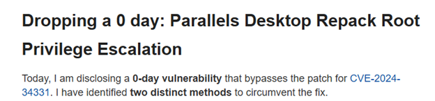
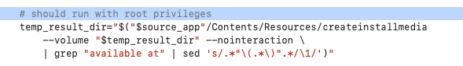
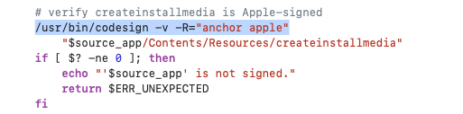
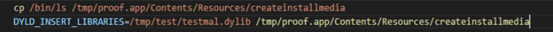

# Атака через Parallels Desktop
*Дмитрий Лифанов*

Parallels — это программное обеспечение для виртуализации, которое позволяет запускать виртуальные машины с различными операционками на устройствах, работающих под управлением macOS. Осенью 2024 года в продукте Parallels Desktop для Mac OS была найдена уязвимость [CVE-2024-34331](https://www.cve.org/CVERecord?id=CVE-2024-34331), позволяющая повышать привилегии в атакованной системе. 

Через некоторое время компания-производитель выпустила исправление. Но в феврале 2025 года независимый исследователь опубликовал эксплоит, позволяющий обходить этот патч - и снова эксплуатировать уязвимость. 

В ответ на это компания снова [выпустила исправление](https://kb.parallels.com/ru/130944/)... Однако можно предположить, что далеко не все пользователи Parallels уследили за этой чередой исправлений - а значит, они могут стать жертвами атак. Поэтому мы решили рассказать, в чём заключается упомянутая уязвимость и как обнаружить попытки её эксплуатации у себя в инфраструктуре.

Основная проблема CVE-2024-34331 касается отсутствия проверки подписи в ходе выполнения сценария repack_osx_install_app.sh, что позволяет запустить файл createinstallmedia с правами root без проверки принадлежности файла к дистрибутиву macOS. 

Файл сreateinstallmedia является утилитой командной строки в macOS, которая применяется для создания загрузочного носителя с дистрибутивом macOS
Данный сценарий не требует ввода учетных данных привилегированного пользователя, поскольку он выполняется prl_disp_service демоном с привилегиями root благодаря наличию SUID-бита, позволяющего при запуске изменить свой UID на UID владельца файла, которым является root:

Таким образом атакующий может создать вредоносный файл createinstallmedia в составе поддельного дистрибутива macOS и запустить стандартный сценарий распаковки и установки виртуальной машины из образа, что приведет к запуску вредоносного файла с привилегиями root.

После первого исправления уязвимости в коде repack_osx_install_app.sh появилась дополнительная проверка с использованием команды codesign -v -R= "anchor apple" на наличие подписи Apple:

Но такой проверки оказалось недостаточно для полного исправления уязвимости. Обойти проверку можно несколькими способами. Первый вариант - это атака Time-of-Check to Time-of-Use(TOCTOU): атакующий может произвести манипуляцию с файлами и замаскироваться под легитимный createinstallmedia, произведя подмену во временном каталоге при перепаковке дистрибутива в промежутке между проверкой подписи у файла и его непосредственным запуском. 

Второй вариант основан на том, что файл должен быть подписан Apple без каких-либо других требований к нему. Таким образом, можно создать поддельный дистрибутив macOS и подменить файл createinstallmedia на переименованный исполняемый файл, подписанный Apple. Например, файл можно подменить на /bin/ls, который аналогично имеет подпись Apple и произвести загрузку вредоносной динамической библиотеки (DYLIB):

Разработчики выпустили исправление в версии Parallels Desktop for Mac OS 19.4.1, переключив функцию переупаковки с do_repack_createinstallmedia на do_repack_manual; новый метод использует сжатие с использованием 7z, входящего в состав Parallels Desktop. Данное изменение не привело к полному исправлению уязвимости и открыло новый способ повышения привилегий схожим образом.

В функции do_repack_manual есть возможность при вызове переупаковки с помощью манипуляции с параметром CFBundleDisplayName произвести подмену исполняемого файла 7z на этапе процесса переупаковки за счет создания символьной ссылки, что приведет к выполнению целевого файла с правами root. Для этого атакующий может создать поддельный инсталляционный образ macOS, создать символьную ссылку, переопределяющую расположение 7z из приложения Parallels на вредоносную нагрузку, и инициировать процесс перепаковки вручную, например, с помощью консольной команды open.

В версии 20.2.1 вендор вернулся к изначальной реализации с do_repack_createinstallmedia, что вернуло возможность использовать первоначальные векторы атаки с манипуляцией над файлом createinstallmedia. И только в версиях 20.2.2 и 19.4.2 данная проблема была исправлена.

## Как выявить попытки эксплуатации уязвимости:

- Отслеживать попытки открытия файлов через консоль с использованием Parallels Desktop. Команда может выглядеть, например, так: “open /tmp/proof.app -a /Applications/Parallels Desktop.app”. Таким способом атакующий может вызвать сценарии переупаковки, не дожидаясь легитимного запуска от пользователя.
- Отслеживать создание символьных ссылок на объекты, расположенные в пользовательских каталогах и tmp-каталогах.
- Отслеживать действия над файлами createinstallmedia, boot.efi, systemversion.plist, platfromsupport.plist и basesystem.dmg, которые не связаны с дистрибутивом macOS Install OS X и самой системой.
- Мониторить активности, связанные с использованием переменных DYLD_* с целью загрузки подозрительных динамических библиотек. В частности, DYLD_INSERT_LIBRARIES позволяет произвести загрузку динамической библиотеки в процессе выполнения приложения, а DYLD_LIBRARY_PATH позволяет переопределить путь поиска динамических библиотек. 
- Отслеживать загрузку подозрительных динамических библиотек в процесс, например, с использованием события ESF ES_EVENT_TYPE_NOTIFY_MMAP.
- Отслеживать создание директорий и файлов в них, содержащих в пути .app, похожих на приложение и его контент, но расположенных в нетиповых локациях для приложений и пакетов.

