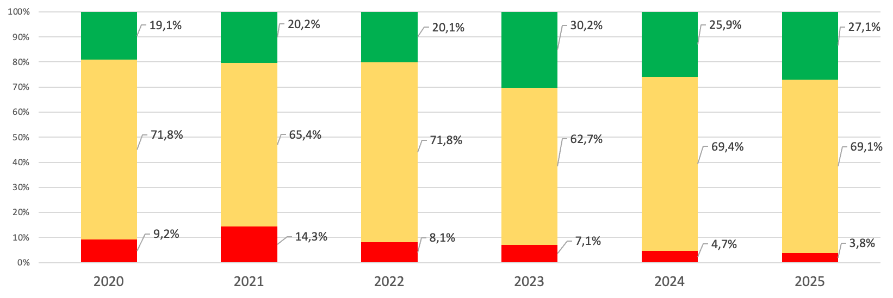
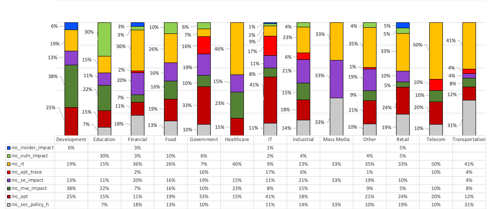
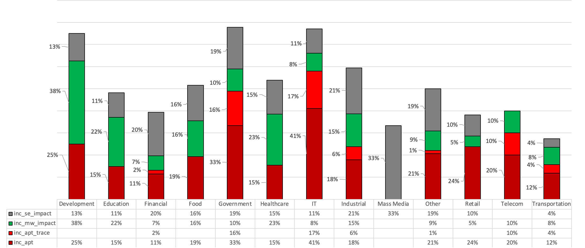
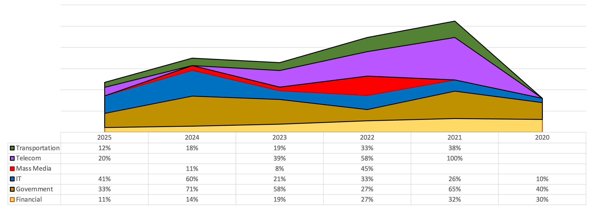
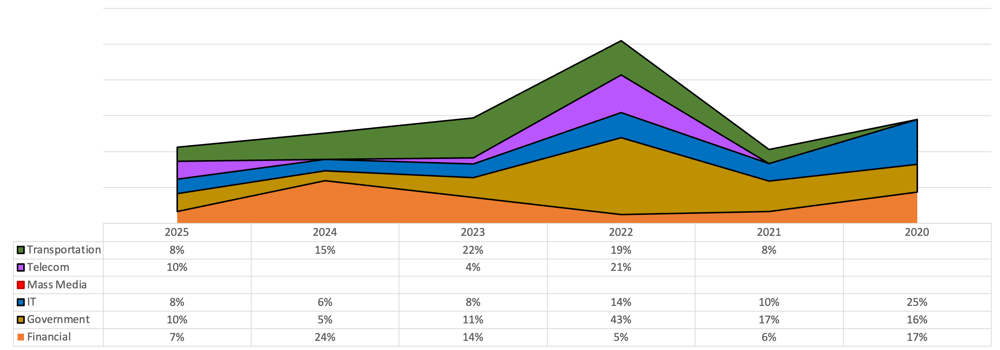
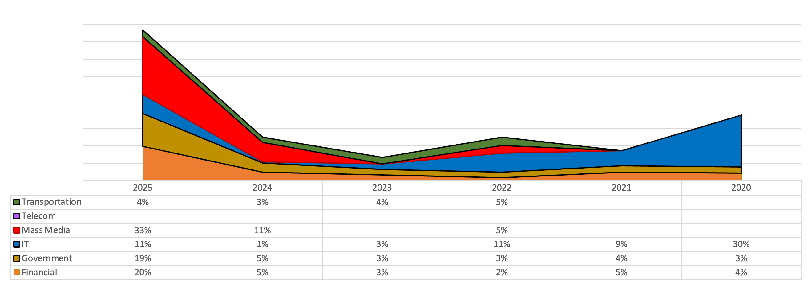

# История критичных инцидентов 
*Сергей Солдатов*

В каждом [аналитическом отчете](https://github.com/klsecservices/Publications/tree/master/Reports) по мотивам работы нашей [команды MDR](https://www.kaspersky.ru/enterprise-security/managed-detection-and-response) есть раздел «Природа критичных инцидентов», где мы делимся распределением [типов](https://dzen.ru/a/aYrHqZptcHH69AFX) критичных инцидентов по отраслям. А иногда даже позволяем себе осторожную аналитику - вроде того, что госсектор наиболее часто подвержен человекоуправляемым атакам как с целью шпионажа, так и с целью парализации работы. А финансовые учреждения, несмотря на более зрелые (в среднем) подходы к обеспечению ИБ, нередко оказываются жертвами по очевидной причине вероятной финансовой выгоды для злоумышленников. 

Кроме того, начиная с 2021 года наблюдается стабильный рост компрометации инфраструктур через доверенных поставщиков [решений](https://attack.mitre.org/techniques/T1474/) и\или [услуг](https://attack.mitre.org/techniques/T1199/) - поскольку это зачастую проще, чем взлом через периметр с последующим незаметным проходом через эшелонированную оборону высокозрелой корпорации (хотя и [такие сценарии](https://attack.mitre.org/techniques/T1190/) каждый год попадают в TOP-5).

Несложно также заметить связь между ландшафтом киберугроз и политической ситуацией в мире; многие конфликты начинаются в киберпространстве и только спустя некоторое время получают свое отражение на политической карте мира. Такая связь прослеживается при анализе изменения характера высококритичных инцидентов по годам, что опять-таки [было показано](https://www.brighttalk.com/webcast/18657/647057) на основе наших ежегодных отчётов.

Но не менее интересные наблюдения можно сделать, если проследить изменение характера высококритичных инцидентов по отраслям. Об этом и поговорим в настоящем исследовании.

## Критичные инциденты в 2025

Доля инцидентов критичности High сейчас невелика: в 2025 году она составила менее 4% от общего количества инцидентов MDR. Если же посмотреть на историю изменения инцидентов по критичности за разные годы, то картина будет следующая.

 
Всплеск по доле высококритичных инцидентов был в 2021, его природа прояснилась в 2022 году. Но далее – стабильный спад. Этот всплеск мы уже не раз разбирали, поэтому двинемся далее.
 
Сфокусируемся исключительно на инцидентах с критичностью High - и посмотрим какую долю от общего количества критичных инцидентов занимал каждый из типов в 2025 году в разбиении по отраслям:
 

 
Из этой статистики мы можем узнать, кто больше проводил киберучений (inc_rt) или у кого было больше "подозрительной активности от легитимных учетных записей без видимых следов взлома, но без подтверждения, что это инсайдеры" (inc_sec_policy_h).

Но наша цель – анализ ландшафта киберугроз, а он имеет очень опосредованное отражение в доле пентестов и киберучений. И тем более, не может зависеть от подтверждения заказчиком случаев атак инсайдеров (да и MDR – не самый эффективный инструмент обнаружения инсайдеров). 

Кроме того, стоит убрать из рассмотрения атаки на отказ в обслуживании (коих не замечено в статистике MDR за 2025, но они встречались ранее), а также пункт inc_vuln_impact - обнаружение критичных уязвимостей  (поскольку и здесь MDR проигрывает в эффективности [специализированным средствам](https://en.wikipedia.org/wiki/Vulnerability_management)). 

Убрав то, что не характеризует ландшафт угроз и то, где MDR не может предоставить объективную картину, получаем такой расклад на 2025 год:
 

Из картинки следует, что каждый третий критичный инцидент в СМИ был "успешная социалка" (inc_se_impact). Интересно, что оставшиеся две трети поделили между собой "работа подтвержденного инсайдера" (inc_insider_impact) и "пентест" (inc_rt). 

При этом по человекоуправляемым атакам (inc_apt) IТ-компании обогнали традиционного лидера, Госсектор: 41% против 33%. Причем и доля прошлых человекоуправляемых атак (inc_apt_trace – обнаружение артефактов человекоуправляемых атак, но на момент обнаружения активных действий злоумышленника не наблюдалось) в IT-сфере также обгоняет Госсектор: 17% против 16%. 

На первый взгляд любопытно, что человекоуправляемые атаки наблюдались и у девелоперов – в каждом четвертом случае (25%). Однако ситуацию поясняет первое место по критичным атакам ВПО (38%). Поскольку современные [атаки шифровальщиков начинаются как человекоуправляемые](https://media.kaspersky.com/landgo/Kaspersky/Report_Notes_of_Cyber_inspector.pdf), можно утверждать, что эти две доли отражают одни и те же атаки, но обнаруженные и остановленные в MDR на разных этапах. В таких случаях обнаружение на этапе активных действий атакующего (inc_apt) значительно привлекательнее, так как к моменту запуска шифровальщика (inc_mw_impact) сеть уже полностью скомпрометирована и шансы на успешное реагирование невелики. 

Описанная ситуация с девелоперами характерна для всех отраслей, где атакующие заинтересованы в прерывании работы - включая Промышленность, Транспорт, Здравоохранение и образовательные учреждения. Для Образования и Здравоохранения характерной целью атакующих также являются персональные данные, аналогичная цель преследуется в атаках на Ритейл. 

## Человекоуправляемые атаки

Интересно посмотреть, как изменялись приоритеты человекоуправляемых атак во времени. Для упрощения анализа оставим в рассмотрении только следующие отрасли: Транспорт, Телеком, СМИ, ИТ, Госсектор, Финансы.
 

Из представленной визуализации можно сделать следующие наблюдения:

- В Финансах всегда присутствует некоторая доля человекоуправляемых атак. Наибольшая их доля от общего объема критичных инцидентов в отрасли за год наблюдалась в 2020 и 2021 годах, но с тех пор стабильное снижение.

- В Госучреждениях доля человекоуправляемых атак наиболее значимая. Первый всплеск (65%) был в 2021-м, второй (71%) – в 2024-м. В 2022 году замечен сравнительно большой (до 27%) спад активности, но в других отраслях, напротив, наблюдался рост.

- В ИТ-сфере с 2020 года наблюдается стабильный рост доли человекоуправляемых атак, и их доля по объему приближается к ситуации в Госсекторе, что является прямым подтверждением растущей популярности атак на цепочку поставок, что мы и [видим в новостях](https://t.me/purpleshift/155). 

- Все атаки на Телекомы в 2021-м были человекоуправляемые, а наиболее вероятная цель – эксплуатация доверительных отношений (скорее всего, уже в следующем, 2022 году). Но с тех пор наблюдается спад, с одновременным ростом в ИТ, что особенно выразилось в 2024 году, где доля в Телекомах – 0%, а в ИТ – 60%. Видимо, результативность атак на цепочку поставок выше, и они теснят доверительные отношения.

- СМИ формируют общественное мнение, поэтому им особенно досталось в 2022-м - при том, что в 2020 и 2021 годах интерес к ним отсутствовал вовсе (и это не связано с отсутствием клиентов из этого сектора). Однако, в последующие годы интерес атакующих к этой отрасли вновь значительно снизился: в 2025 году вернулись на уровень 2020-21 гг.

- Доля человекоуправляемых атак на транспортные предприятия остается невысокой. Наибольший уровень наблюдался в 2021 (38%) и 2022 (33%), но с тех пор – незначительный спад, но не до нуля, как в СМИ.

## Критичные атаки ВПО

Ранее мы отмечали, что человекоуправляемые атаки и атаки ВПО нередко представляют собой один инцидент, обнаруженный на разных этапах. Поэтому интересно оглянуться на высококритичные атаки ВПО по секторам экономики:

 
- Финансовую отрасль стабильно атакуют с помощью ВПО, но больше всего им досталось в 2024 году (24%). А в 2021 и 2022 годах в Финансах, напротив, был спад; видимо, атакающующие сконцентрировались на более приоритетные направлениях.

- Одним из таких приоритетных секторов экономики был Госсектор, в 2022 году таким учреждениям больше всего досталось – 43% критичных атак с ВПО. В [отчете за 2022 год](https://github.com/klsecservices/Publications/blob/master/Reports/MDR-Analyst-Report-2022.pdf) техника T1078 отметилась в TOP-3, что является следствием эксплуатации доверительных отношений (вполне вероятно, со стороны Телекомов, поломанных еще в 2021-м). 

- О том, что Телекомы были поломаны еще в 2021 году, свидетельствует не только график с человекоуправляемыми атаками из предыдущего раздела, но и высокая доля атак ВПО на этот сектор в 2022 году – 21%. Особенно с учетом того, что в 2023 году таких атак было лишь 4%, а в 2025-м случился рост только до 10% (скорее, связанный с 20% человекоуправляемых атак на Телекомы в этом же году).

- ИТ-сфере стабильно достается от ВПО, но доля невелика: максимумы наблюдались в 2020 году (25%) и в 2022 году (14%). Последующие годы – доля таких атак не превышала одной десятой. Все-таки ИТ ломают главным образом не для того, чтобы зашифровать, а для развития атаки через цепочку поставок. А значит, атакующим надо сидеть в инфраструктуре максимально тихо и незаметно.

- Любопытно, что атак ВПО на клиентов MDR из отрасли СМИ не замечали на всем периоде наблюдений, хотя в 2022 году этот сектор экономики был в лидерах по доле человекоуправляемых атак от общего числа критичных инцидентов, уступая только Телекомам. Это – замечательно, поскольку, как отмечено выше, обнаружение атак шифровальщиков на этапе работы ВПО без видимого участия человека, при отсутствии ошибок  со стороны атакующих, крайне редко заканчиваются успешным восстановлением данных. 

- Транспортные компании [стабильно атакуются ВПО](https://www.vedomosti.ru/business/articles/2024/05/28/1039828-prichinoi-sboya-v-rabote-sdek-mog-stat-virus-shifrovalschik), максимумы наблюдались в 2022 (19%) и 2023 (22%), а в уже не раз упомянутом лидере по критичным инцидентам -  2022 год - доля ВПО у транспортников была сравнима с ИБ-зрелыми Финансами – 8% против 6%.

## Социальная инженерия

Уже не раз мы отмечали связь между человекоуправляемыми атаками и атаками ВПО, которые  большинстве случаев происходят тогда, когда работа человека уже закончилась. [Социальная инженерия](https://attack.mitre.org/techniques/T1566/) на протяжении всего периода наших наблюдений входила в TOP-3 сценариев получения [первоначального доступа](https://attack.mitre.org/tactics/TA0001/). В общем случае типовая атака выглядит примерно так: Социальная инженерия ==> Человекоуправляемый этап ==> Ущерб с использованием ВПО. 

В рамках MDR не проводится тяжелая форенсика и глубокий анализ, поэтому обнаружение инцидента ВПО не всегда раскручивается до этапа человекоуправляемости, и еще реже – до социалки; тем более что обнаружение ВПО и получение первоначального доступа могут разделять многие недели. Но можно представить, что инциденты, обнаруженные и предотвращенные на этапе социалки, будучи пропущенными, далее могли быть замечены как человекоуправляемая атака, а в случае пропуска и здесь – уже как ВПО, приносящее значимый ущерб. Поэтому возникает гипотеза, что если мы фиксируем больше человекоуправляемых атак и ВПО, то выявлено меньше социалки, и наоборот. 

И ещё одна гипотеза: за периодами с преобладающей социалкой следуют периоды с преобладающим количеством человекоуправляемых атак и ВПО, поскольку что-то из прошлых попыток фишинга конвертировалось в успех, и чем больше попыток, тем выше результативность.

Для подтверждения выдвинутых предположений, рассмотрим визуализацию распределения социальной инженерии по отраслям за период с 2020 по 2025 год.

 
Доля человекоуправляемых атак и ВПО в большинстве случаев действительно изменяются в противофазе к атакам социальной инженерии. Исключение составляет 2022 год, где от социалки страдали все. И больше всех – ИТ, но доля была сравнительно небольшой: 11% от общего числа критичных инцидентов в этом секторе в этом году. 

Но больше всего ИТ досталось в 2020 году – 30%, и далее – падение до 1% в 2024. Однако мы отмечали рост доли человекоуправлямых атак именно в ИТ аж до 60% в 2024 году - это как будто подтверждает выдвинутую ранее гипотезу о трансформации социалки в человекоуправляемые атаки со временем. 

В 2025 в ИТ снова наблюдался рост социалки с 1% до 11%, но и доля человекоуправляемых атак тоже была достаточно высокой – 41%. Возможно, период перехода фишинга в дальнейшее развитие атаки сокращается, следовательно, результативность и успешность социалки растет.

В пользу увеличения результативности фишинга свидетельствует и общий значительный рост доли таких атак по всем секторам экономики. После непродолжительного затишья в 2023-м, атакующие снова начали забрасывать социалкой СМИ – в 2024 году доля фишинга составила 11%, а уже в 2025 – 33%, что дает основания ожидать рост человекоуправляемых атак на СМИ в последующие годы.

Любопытно, что критичных инцидентов, связанных с успешной социалкой, не наблюдали в Телекоме, хотя человекоуправляемые атаки и ВПО там видели, и в 2021-22 гг. Телеком был в лидерах. Вероятно, первоначальный доступ в Телекомы получают иначе.

## Заключение

Широкое покрытие различных секторов экономики позволяет строить гипотезы, подтверждающиеся на практике, а продолжительный период наблюдения – заметить тенденции, период которых значительно превышает один год.
 
Мы рассматривали исключительно критичные инциденты, поскольку подготовка и осуществление таких атак требует больших усилий от атакующих, а, следовательно, анализ таких инцидентов лучше отражает наиболее вероятную мотивацию злоумышленников.
 
Фокусировка – залог успеха, и этот принцип не чужд атакующим, поэтому в разные годы можно наблюдать интерес злоумышленников к разным отраслям. Сопоставление данных о наиболее атакуемых отраслях экономики с общемировой ситуацией поясняет мотивацию атакующих: например, атаки на СМИ и Госсектор в 2022 году или атаки Телекомы годом ранее.

Наблюдение за изменениями типов атак и фокуса по отраслям позволяет выделить повторяющиеся зависимости. Например, всплеск фишинг-атак далее трансформируется в человекоуправляемые атаки, которые, в свою очередь разовьются в атаки ВПО для нанесения ущерба. 

Можно увидеть и менее заметные (на небольших периодах наблюдения) тенденции - такие, как смещение фокуса атакующих с Телекомов на ИТ, в качестве подтверждения роста атак на цепочки поставок, в сравнении исторически лидирующими сценариями эксплуатации доверительных отношений.

