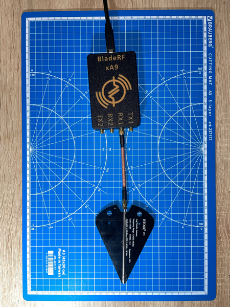
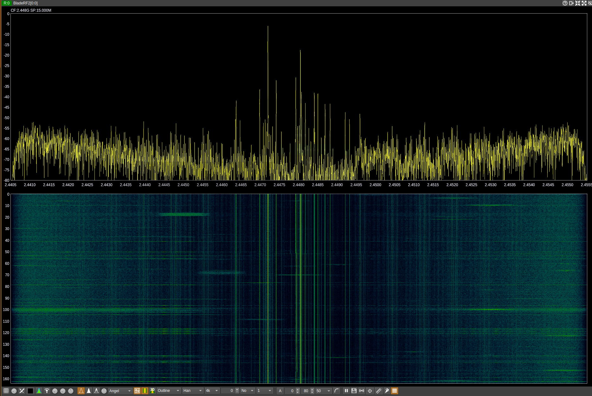
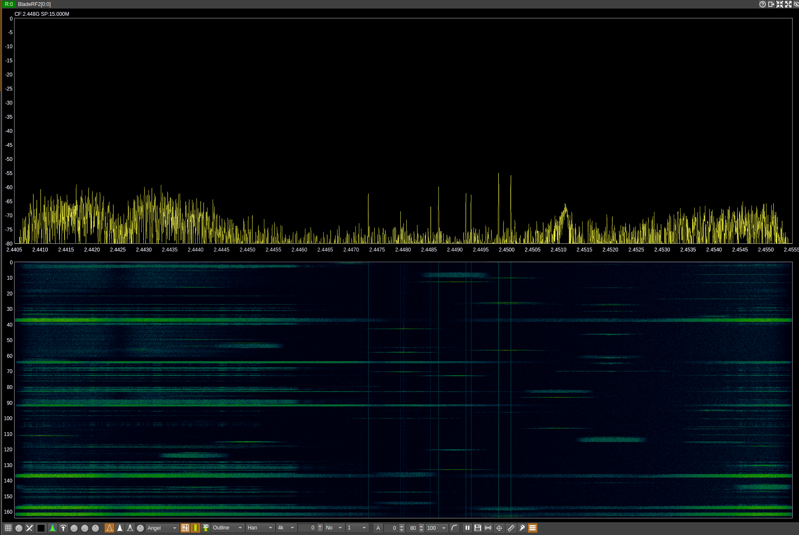
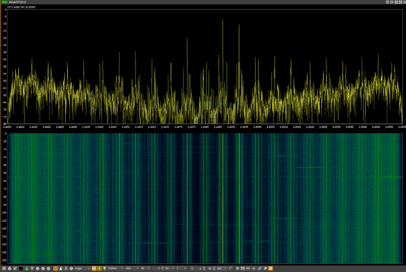
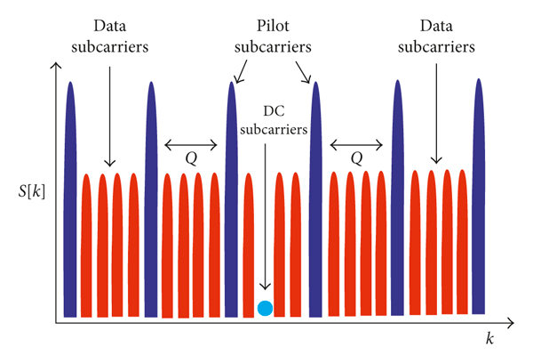

# Радиодело, или Кто убил мой Wi-Fi?
*Никита Прошин, Сергей Андреев*

А бывало ли у вас так, что сидите вы в каком-то помещении, а там — то Wi-Fi подлагнёт, то Bluetooth-гарнитура "ёкнет"? Эдак раза два за день, знакомо? С одной стороны, неприятно. Но с другой — это не настолько мешает жить, чтобы закапываться вглубь проблемы или обсуждать с коллегами на кухне. В итоге где-то в воздухе повисает вывод типа "да эти наушники/ноутбук уже доживают своё, что с них взять!".  

А вот у нас нашла коса на камень, который было совершенно невозможно игнорировать. Так и получился коротенький, но интересный детектив, условно именуемый Радиоделом.

## Призрак в столе

Прекрасным весенним утром Николас, по своему обыкновению допивающий уже вторую чашку чая, занимался новым проектом по анализу защищённости. Не то чтобы IoT-устройства были для него уже чем-то обыденным, но в этот раз для подогрева своего интереса он намеренно выбрал для себя что-то новое: роль устройства необычна, интерфейсов много и на любой вкус, и Android-приложение присутствует.

Настройка стенда обернулась разочарованием: устройство отчаянно отказывалось подключаться к Wi-Fi-хотспоту, организованному тут же на коленке с помощью Android-смартфона. Альтернативный Android-аппарат тоже не решил проблемы, как и идея пододвинуть пациентов вплотную друг к другу.

"Брак", — с грустью подумал Николас, и в его голове мгновенно закрутились отнюдь не радужные образы возврата товара и откладывания проекта в долгий ящик. Однако, припомнив фантомные радио-проблемы, давно наблюдаемые в этой части помещения, он решил продолжить эксперименты.

Ирэн и Хью, заметив явное замешательство нашего героя, мгновенно подключились к процессу расследования. Было установлено, что рабочее место Николаса находится во власти некой аномалии, если не сказать "проклято". Команда стала перемещать хотспот с места на место по всему помещению. Выяснилось, что размер аномалии — примерно 5 на 5 футов с эпицентром прямо в столе Николаса.

Это был момент осознания: дело должно быть раскрыто, пора вызывать уважаемого сэра Генри и его радиооборудование.

## Охотники за привидением

Через пару дней, уважаемый сэр Генри, никогда не отказывающий товарищам в услуге, появился на пороге с BladeRF и широкодиапазонной логопериодической антенной 600 МГц - 6 ГГц (рисунок 1). 

Собрав сетап из ноутбука с GNU Radio, BladeRF и антенны, команда приступила к исследованию окружения. Принцип исследования прост: если на линии (в обе стороны) "стрелы" такой антенны что-то активно происходит в заданном заранее диапазоне (район 2.4 ГГц),  это будет видно на графике и waterfall-диаграмме. Но да, процесс выглядит похожим на мистические практики XIX века или на фильм "Охотники за привидениями". 

Первые результаты показали, что при минимальном количестве известных устройств, активно использующих 2.4 ГГц, в районе "аномалии Николаса" наблюдается следующая резкая картина (рисунок 2):

Присутствуют ярко выраженные сильные и постоянные сигналы в районе 2.4470 и 2.4480, а также другие, менее четкие, но всё же заметные по всей ширине выбранного спектра. 

Сыщики убедились: всё это неспроста, нужно слушать дальше. Около получаса ушло на обход помещения вдоль и поперёк: обошли все точки вокруг аномальной зоны, побродили по другим этажам для поиска похожей картины, и даже вышли на улицу. 

Результат прелюбопытен: на своём этаже порой наблюдались менее выраженные, но всё же заметные признаки аналогичной аномалии. На других этажах — нечто очень слабое в районе потолков и полов (рисунок 3).

Исключая варианты один за другим и подбираясь всё ближе к источнику проблем, сыщики наткнулись на следующую картину вблизи аномальной зоны (рисунок 4). Бинго!

## Почему убийца — дворецкий? 

Виновником проблем оказался... датчик движения, работающий по принципу активного радара. Принцип этот достаточно прост: анализ отраженного от движущихся объектов излучения с ориентиром на изменение АЧХ/ФЧХ переотраженных сигналов (а некоторые и эффект Допплера могут использовать).

Что же так сильно в этом не устраивает Wi-Fi-устройства, которые пытаются установить соединение на рабочем месте Николаса? Ниже приводим выкладки от ~~Шерлока~~ сэра Генри и компании.

Для установления соединения с клиентом Wi-Fi AP выбирает канал. Канал = часть спектра шириной (в нашем случае) 20 МГц. Стандарт 802.11b/g/n использует 14 каналов с настолько сильным перекрытием, что полностью "отдельными" друг от друга могут считаться только 1-й, 6-й и 14-й.

Алгоритм выбора канала может быть разный: с наименьшим количеством помех, статичный, случайный, etc. В нашем случае AP отказывался работать стабильно, что позволяет сказать: канал (по какому бы алгоритму он не выбирался) выбирался "неудачно" с точки зрения помех.

В рамках канала Wi-Fi использует метод мультиплексирования OFDM (Orthogonal Frequency Division Multiplexing). Если очень упрощённо, то предполагается разделение канала на подканалы (подчастоты) с целью реализации работы с несколькими клиентами единовременно и/или ускорения работы с одним клиентом за счёт параллельных посылок на разных подчастотах.Такое "разбитие" OFDM схематично иллюстрируется следующим образом (рисунок 5):

Здесь data subcarriers и есть те самые подчастоты. А вот pilot subcarriers уже интереснее — с их помощью устройства "договариваются" об относительном расположении data subcarriers (Carrier Frequency Offset, CFO), а также о базовых параметрах длительности передаваемых символов на data subcarriers (Sampling Frequency Offset, SFO)

Важный момент: на "пилотах" нет какого-то протокола, это опорные частоты, относительно которых происходят расчёты и подстройка/синхронизация во время работы.

Попадание помехи в data subcarrier не так страшно, в конце концов есть альтернативные, да и "договориться" об их использовании с помощью pilot-ов тоже возможно.

А вот попадание в pilot рассинхронизирует AP и его клиента в расположении subcarrier'ов и длительности передаваемых символов. В результате имеем тотальное непонимание устройствами друг друга. Про попадание в несколько "пилотов" разом и говорить не приходится.

Но откуда же такая маленькая и локализованная "аномальная зона"? Ответ прост: на столе у Николаса сходились сигналы, посылаемые аж *двумя* такими датчиками. *Total annihilation*.

P.S. 
История закончилась хорошо, и опыт с отключением предполагаемых виновников подтвердил основы наших догадок. Элементарно, ~~Ватсон~~ Николас!
