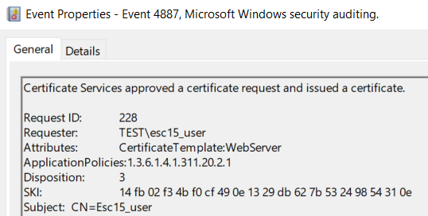
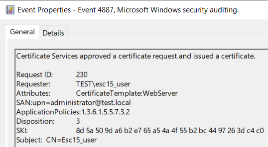
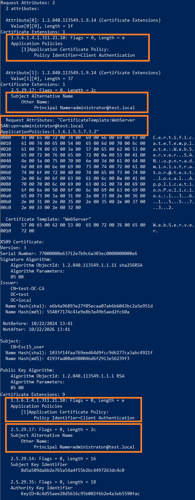

# Снова уязвимые шаблоны ADCS: детектируем технику ESC15
*Дмитрий Щетинин*

В начале октября была обнаружена очередная возможность повышения привилегий с помощью шаблонов сертификатов ADCS - техника [ESC15](https://trustedsec.com/blog/ekuwu-not-just-another-ad-cs-esc). Уязвимыми являются шаблоны сертификатов с 1-й версией схемы и возможностью указать subjectAltName (SAN) в CSR. Также нужно знать учётные данные пользователя с правами Enroll на уязвимый шаблон.

Одним из встроенных уязвимых шаблонов является **WebServer** (Version:1 и CT_FLAG_ENROLLEE_SUPPLIES_SUBJECT). По-умолчанию, запрашивать сертификаты, используя этот шаблон, могут только Domain- и Enterprise-администраторы. Но по нашему опыту, пользователи часто меняют права на него, и нередко можно встретить там даже Authenticated Users.

## Суть эксплуатации

При наличии у сертификата расширения **Application Policies** и **Extended Key Usage (EKU)**, домен-контроллер [предпочтёт](https://learn.microsoft.com/en-us/previous-versions/windows/it-pro/windows-server-2003/cc776986(v=ws.10)?redirectedfrom=MSDN) верить EKU из "Application Policies".

То есть при запросе сертификата, используя уязвимый шаблон, атакующий может добавить EKU "Client Authentication" в поле "Application Policies", добавить администратора домена в SAN и, получив сертификат, успешно запросить TGT для этого администратора. Получается очень похоже на технику ESC1. Единственное ограничение - это возможность аутентификации только по schannel на LDAP.

Также атакующий может добавить EKU "Certificate Request Agent" в поле "Application Policies" и использовать полученный сертификат для запроса ещё одного, но уже на любого пользователя, как это реализовано в технике ESC3. Либо добавить "Code Signing" в "Application Policies" - и использовать сертификат для подписи файлов.

Для эксплуатации можно использовать утилиту certipy ([PR](https://github.com/ly4k/Certipy/pull/228) ещё не заапрувлен) либо [PSCertificateEnrollment](https://github.com/Sleepw4lker/PSCertificateEnrollment).

## Как детектировать

Для детектирования уязвимых шаблонов можно использовать событие с EventID 4898 (лучше включить флаг [EDITF_AUDITCERTTEMPLATELOAD](https://learn.microsoft.com/en-us/previous-versions/windows/it-pro/windows-server-2012-r2-and-2012/dn786432(v=ws.11)#monitoring-changes-to-certificate-templates)), абстрактно запрос выглядит так:
```
EventID:4898 AND TemplateContent:"CT_FLAG_ENROLLEE_SUPPLIES_SUBJECT" AND TemplateSchemaVersion:1
```


Также можно воспользоваться обновленной в рамках [PR](https://github.com/ly4k/Certipy/pull/228) командой find утилиты certipy, либо LDAP запросом:
```
Get-ADObject -LDAPFilter '(&(objectclass=pkicertificatetemplate)(!(mspki-enrollment-flag:1.2.840.113556.1.4.804:=2))(|(mspki-ra-signature=0)(!(mspki-ra-signature=*)))(mspki-template-schema-version=1)(mspki-certificate-name-flag:1.2.840.113556.1.4.804:=1))' -SearchBase 'CN=Configuration,DC=test,DC=local' -Properties DisplayName
```

При использовании утилиты certipy, в атрибутах запроса события 4887 будет [специфичное содержание](https://github.com/dru1d-foofus/Certipy/blob/39329457efcaef15e3b2d68c6e543fe63f54a27a/certipy/commands/req.py#L732).


Полагаться на это при детектировании запроса нельзя, так как это необязательное поле в CSR. Например, при добавлении Application Policies в поле атрибутов мы увидим имя шаблона и OID добавленной политики:
```
CertificateTemplate:WebServer ApplicationPolicies:1.3.6.1.4.1.311.20.2.1
```


Если запросить сертификат c SAN, то выглядеть это будет уже следующим образом:
```
CertificateTemplate:WebServer SAN:upn=administrator@test.local ApplicationPolicies:1.3.6.1.5.5.7.3.2
```



Если есть возможность получать события из БД ADCS, то там подобные запросы выглядят так:



Посмотреть, как это выглядит в БД, можно с помощью certutil:
```
certutil.exe -v -view -restrict "RequestID=230" -out Request.RequestID,Request.RawRequest,Request.RequestAttributes,CertificateTemplate,RawCertificate
```

## Что делать после обнаружения уязвимых шаблонов 

Есть несколько вариантов действий:

1. Удалить неиспользуемые шаблоны или отключить их. Можно сделать это, используя скрипт [ESC15.ps1](https://gist.github.com/bandrel/da0f3f9cc2c319d1a1d4e92a29d02b04) и [Unpublish-SchemaV1Templates.ps1](https://gist.github.com/TrimarcJake/13c7d615adc905d317fc4379026ad28e)
2. Клонировать шаблон, если он необходим. При клонировании, версия схемы нового шаблона автоматически повысится до 2ой и новый шаблон не будет уявзимым к данной технике.
3. Заполнить атрибут [msPKI-Certificate-Application-Policy](https://learn.microsoft.com/en-us/openspecs/windows_protocols/ms-crtd/44012f2d-5ef3-440d-a61b-b30d3d978130) необходимыми для шаблона EKU из атрибута [pKIExtendedKeyUsage](https://learn.microsoft.com/en-us/openspecs/windows_protocols/ms-crtd/be8af2e6-01d8-49a5-bacf-be641041ac73), используя скрипт [Remediate-ESC15.ps1](https://github.com/JonasBK/Powershell/blob/master/Remediate-ESC15.ps1). В этом случае, при запросе сертификата, CA добавит в Application Policy сертификата EKU из шаблона - и атакующий не сможет добавить свои EKU из запроса. Этот способ не сработает для шаблонов, у которых атрибуты msPKI-Certificate-Application-Policy и pKIExtendedKeyUsage специально выставлены в Null, например SubCA, CA, CrossCA. Следить за тем, кто может выпускать сертификаты, используя подобные шаблоны, нужно особенно внимательно.
4. Если вы уверены, что данное расширение вам не нужно, то можно отключить добавление Application Policies к сертификату:
```
certutil -setreg policy\DisableExtensionList +1.3.6.1.4.1.311.21.10
```

Но в любом случае необходимо проверить выпущенные сертификаты с использованием уязвимых шаблонов.
