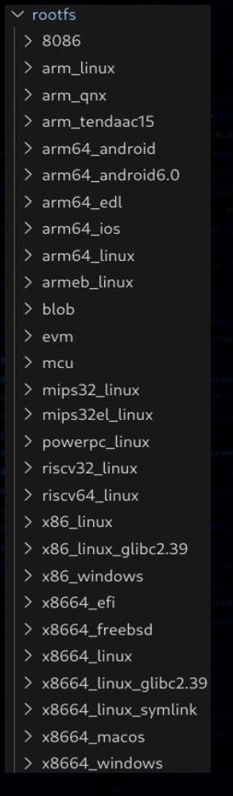

#  Расчехляем Qiling, или Фаззинг прошивок: эмуляция вместо железа
*Никита Прошин*


В проектах по анализу защищённости одним из самых "неблагодарных" дел является фаззинг прошивок. Подготовка стендов и окружений может занимать довольно много времени, а разнообразие архитектур, baremetal-реализаций и RTOS точно не способствует фаззингу "по методичке".

Если же исследователь оказался завален сдампленными прошивками от множества устройств (а на некоторых проектах приходится работать с целым зоопарком железа), неизбежно возникает вопрос о расстановке приоритетов. Выбор, естественно, делается в пользу наиболее критичных подсистем и интерфейсов, однако и остальным пациентам хочется уделить должное внимание.
 
Фреймворк для эмуляции двоичных файлов [Qiling](https://github.com/qilingframework/qiling), названный в честь мифического китайского зверя Цилиня, решает объёмный спектр проблем за специалиста, подступающего к вышеописанной нелёгкой задаче. 

Qiling берёт своё начало в небезызвестном фреймворке Unicorn, что обещает нам обилие эмулируемых архитектур (8086, X86, X86_64, ARM, ARM64, MIPS, RISC-V, PowerPC). Архитектурное разнообразие Unicorn имеет обратную сторону в виде отсутствия возможностей по работе с кодом, предполагающим запуск в операционных системах (syscalls, FS, etc.). 

Здесь-то Qiling и проявляет себя во всей красе. Он не просто имеет хороший набор уже реализованных сущностей, но и предоставляет минималистичные rootfs-ы для многих наборов архитектур и операционных систем. А ещё всё это имеет реализацию на Python, что позволяет практически безболезненно дописать что-то отсутствующее прямо "на ходу". 

Итак, переходим к фаззингу!

(1)  Локализуйте интересующий код (Code of Interest, CoI). Qiling в связке с AFL++ позволит нам профаззить не весь код, а только интересующее место, что сильно уменьшает время подготовки:

```python
   ql.run(start=0xaddr1, end=0xaddr2) # исполняемся откуда и докуда хотим
```

(2) Соберите информацию о сущностях, требующихся для работы CoI. Обращения к периферии чипа, общение с интерфейсами, файловой системой и буквально всё остальное, что может помещать CoI успешно выполниться. Отличным выходом будут итеративные попытки запуска эмуляции: 

```python 
ql = Qiling([r'path/to/target'], r'path/to/target/rootfs')
  ql.run(start=0xaddr1, end=0xaddr2)
```

(3) Реализуйте/захукайте места, найденные в п.2. Серьёзный арсенал хуков:

```python
  ql.hook_address(_callback_: Callable, _address_: int) # просто на адресе
  ql.hook_code(_callback_: Callable, _user_data_: Any = None) # каждая инструкция
  ql.hook_block() # каждый basic block
  ql.hook_insn() # инструкция с настройкой особенностей
  ql.hook_mem_unmapped() # на доступ к незамапленной памяти
  #  и т.д.
```

(4) Соберите информацию об ограничениях входных данных. CoI может не проверять, к примеру, длину ввода - но это совсем не значит, что вызывающая функция "двумя этажами выше" тоже этого не делает.

(5) Соберите rootfs, если ваш бинарник касается операционных систем: 

   

(6) Выделите память для входов, генерируемых AFL++. Легко:
    
```python
  ql.mem.map(addr: int, size: int, perms: int = UC_PROT_ALL, info: Optional[str] = None) -> None # выделение памяти
  ql.mem.write(address, data) # запись
```    

(7) Включите встроенный sanitizing или реализуйте его сами. Но помните, что каждый лишний хук портит скорость работы AFL++.    
   
```python
  heap = QlSanitizedMemoryHeap(ql, ql.os.heap, fault_rate=fault_rate) # для некоторых OS доступен, к примеру, такой вариант
```    

(8) Анализируя логику исполнения, найдите лучший из возможных момент исполнения, в который начнёт свою работу forkserver. Требуется встроить всего несколько строк, чтобы наш код стал target-ом для фаззера:

```python
  ql_afl_fuzz(_ql, input_file=input_file, place_input_callback=place_input_callback, exits=[ql.os.exit_point]) # внутри коллбека start_afl() 
  ...
  ql.hook_address(callback=start_afl, address=frksrv_addr) # устанавливаем хук в выбранный адрес для forkserver-а 
```    

(9) Отладьте весь сетап вместе с AFL++ и начинайте фаззить! 
GDB включается очень просто: 


Результаты его работы:
  
  
  
(10) Обратите внимание, что AFL++ может не воспринять ситуацию краша как краш, что фатально для процесса. Необходимым решением будет "переопределение" крашей для AFL: 


  


Enjoy responsibly! Перед применением описанных методик убедитесь в соответствии ваших действий местному законодательству, а при обнаружении уязвимостей в коммерческих продуктах следуйте принципам ответственного разглашения.


